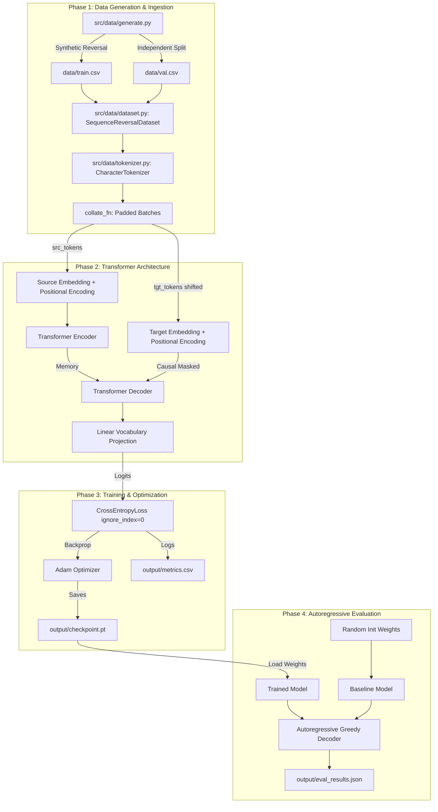

# Architecture & System Design: Tiny Seq2Seq Transformer

This document details the architectural design, tensor transformations, attention masking mechanics, and execution lifecycle of the **Tiny Seq2Seq Transformer** pipeline.

---

## 1. High-Level Pipeline Flow



---

## 2. Tokenization & Special Tokens

The custom `CharacterTokenizer` in [`src/data/tokenizer.py`](file:///c:/Users/rakes/tiny-seq2seq-transformer/src/data/tokenizer.py) maintains an exact 29-token vocabulary:

| Token | Integer ID | Description |
|---|---|---|
| `<PAD>` | `0` | Padding token used to equalize sequence lengths in a batch |
| `<SOS>` | `1` | Start-of-sequence prompt token prepended to sequences |
| `<EOS>` | `2` | End-of-sequence stop token appended to sequences |
| `'A'` .. `'Z'` | `3` .. `28` | Uppercase alphabet character set |

- **Encoding**: Given string `"ABC"`, encoded tokens are `[<SOS>, 'A', 'B', 'C', <EOS>]` $\rightarrow$ `[1, 3, 4, 5, 2]`.
- **Decoding**: Truncates at `<EOS>` and strips `<PAD>` / `<SOS>` to restore the raw character string.

---

## 3. Positional Encoding

Transformers possess no intrinsic recurrence or convolutional inductive bias and are permutation-invariant. Deterministic sinusoidal positional encodings are added directly to token embeddings:

$$PE_{(pos, 2i)} = \sin\left(\frac{pos}{10000^{2i / d_{model}}}\right)$$
$$PE_{(pos, 2i+1)} = \cos\left(\frac{pos}{10000^{2i / d_{model}}}\right)$$

- Implemented in `PositionalEncoding` as a registered persistent buffer (`pe` of shape `[1, max_len, d_model]`).
- Scaled embeddings: $E_{input} = \text{Embedding}(X) \times \sqrt{d_{model}} + PE_{[:, :L, :]}$.

---

## 4. Attention Masking Mechanics

Three distinct attention masks ensure valid training and causal decoding:

1. **Source Padding Mask (`src_padding_mask`)**:
   - Shape: `(batch_size, src_len)` (Boolean).
   - `True` for positions containing `<PAD>` (`0`), preventing self-attention across empty padding slots.
2. **Target Padding Mask (`tgt_padding_mask`)**:
   - Shape: `(batch_size, tgt_len)` (Boolean).
   - `True` for positions containing `<PAD>`.
3. **Target Causal Mask (`tgt_mask`)**:
   - Shape: `(tgt_len, tgt_len)` (Boolean).
   - `True` indicates positions that must be masked.
   - `False` indicates positions that are allowed.
   - The upper triangular portion above the diagonal is masked, preventing position `i` from attending to future positions `j > i`.

```text
Causal Mask Matrix (4x4 example):
[[False, True,  True,  True ],
 [False, False, True,  True ],
 [False, False, False, True ],
 [False, False, False, False]]
```

---

## 5. Training vs Autoregressive Inference

### Teacher Forcing (Training)
During training, the ground truth target sequence `<SOS> C B A <EOS>` is split:
- **`tgt_input`**: `<SOS> C B A` (indices `0` to $N-1$)
- **`tgt_expected`**: `C B A <EOS>` (indices `1` to $N$)
- Forward pass computes predictions for all positions in parallel in a single step using the causal mask.
- Loss is computed via `nn.CrossEntropyLoss(ignore_index=PAD_ID)` to ignore loss on padding tokens.

### Autoregressive Greedy Decoding (Inference)
During evaluation, ground truth target tokens are unavailable:
1. Encode source sequence $X$ to produce memory tensor $M = \text{Encoder}(X)$.
2. Initialize target tensor with start token $Y_0 = [\langle\text{SOS}\rangle]$.
3. Iteratively at step $t$:
   - Pass $(Y_{0..t}, M)$ to the decoder with causal mask.
   - Extract logits for the last token position: $\hat{y}_{t+1} = \operatorname{argmax}(\operatorname{Linear}(\operatorname{Decoder}_{t}))$.
   - Concatenate $\hat{y}_{t+1}$ onto $Y$: $Y_{0..t+1} = [Y_{0..t}, \hat{y}_{t+1}]$.
   - Terminate if $\hat{y}_{t+1} == \langle\text{EOS}\rangle$ or cutoff length is reached.
